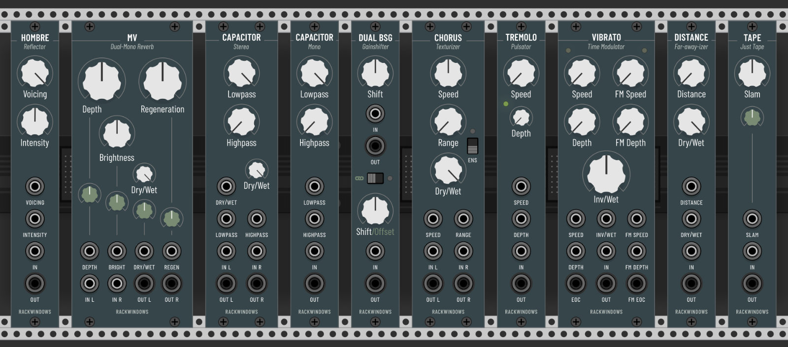
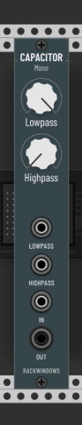
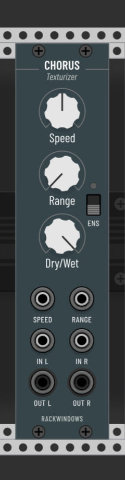
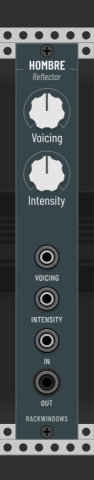
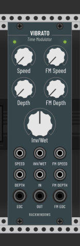

# A collection of VCV Rack modules based on audio plugins by Chris Johnson from Airwindows

NOTE: As of now, this collection is still a work in progress.

Most of these modules are straight-up ports of [Airwindows](http://www.airwindows.com) plugins with the addition of a panel (designed to be potentially buildable in hardware) and the occasional tweak or enhancement here and there to take advantage of the modular environment.

Airwindows plugins are known for exceptional sound quality, innovative approaches and minimalist interfaces. They often focus on and excel at one specific task, which is why I think they are a natural fit for Rack.

For more in-depth information on the inner workings of a particular Airwindows plugin please check Chris' [website](http://www.airwindows.com). There is a video on every plugin along with a description and I encourage everyone to explore his body of work. Chances are you stumble upon other gems here and there. He's got a [Patreon](https://www.patreon.com/airwindows) if you appreciate and want to support what he does.

## Licence

See [LICENSE.md](LICENSE.md) for all licenses

## Modules

- [Capacitor Mono/Stereo](#capacitor): Filters
- [Chorus](#chorus): Mono chorus with multi-tap option
- [Dual BSG](#dual-bsg): Dual gain shifter
- [Hombre](#hombre): Texas tone and texture
- [MV](#mv): Dual-mono reverb
- [Tremolo](#tremolo): Organic pulsating thing
- [Vibrato](#vibrato): FM Vibrator o_O

## Capacitor 

Low- and highpass filters. Comes in both mono and stereo, with the stereo version featuring an additional dry/wet control.

## Chorus 

Description coming soon...

## Dual BSG 

Note that if no input is connected, the respective output will provide constant voltage selectable in 1V steps from -8V to +8V.

More coming soon...

## Hombre 

Description coming soon...

## MV 

Description coming soon...

## Tremolo 

Instead of volume animation Tremolo uses fluctuating saturation and antisaturation curves to create a more organic, somewhat tubey tremolo effect.

More coming soon...

## Vibrato 

Description coming soon...

## Colophon

The typeface used is Barlow by Jeremy Tribby