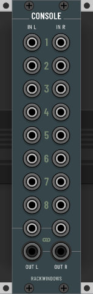
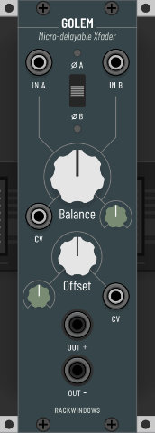
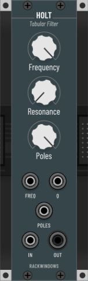
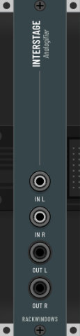
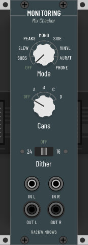
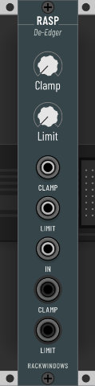
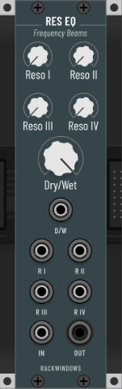
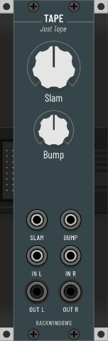

# A collection of VCV Rack modules based on audio plugins by Chris Johnson from Airwindows

Most of these modules are straight-up ports of [Airwindows](http://www.airwindows.com) plugins with the addition of a panel (designed to be potentially buildable in hardware) and the occasional tweak or enhancement to take advantage of the modular environment.

Airwindows plugins are known for exceptional sound quality, innovative approaches and minimalist interfaces. They often focus on and excel at one specific task, which is why I think they are a natural fit for Rack.

For more in-depth information about the inner workings of a particular Airwindows plugin please check Chris' [website](http://www.airwindows.com). There is a video on every plugin along with a description and I encourage everyone to explore his body of work. Chances are you stumble upon other gems here and there. He's got a [Patreon](https://www.patreon.com/airwindows) in case you appreciate and want to support what he does.

**NOTE:** Most modules act a bit differently depending on the selected sample rate, e.g. varying center frequencies on filters. Keep in mind that a number of Airwindows plugins are actually sample rate dependent, therefore in some cases it might be a feature, not a bug.

## Licence

See [LICENSE.md](LICENSE.md) for all licenses

## Modules

- [Capacitor Mono/Stereo](#capacitor): Filters
- [Chorus](#chorus): Chorus with multi-tap option (Ensemble)
- [Console](#console): Stereo summing mixer
- [Console MM](#consolemm): Stereo summing mixer to work in conjunction with MindMeld's MixMaster
- [Distance](#distance): Designed to mimic through-air high frequency attenuation
- [Dual BSG](#dual-bsg): Dual gain shifter
- [Golem](#golem): Micro-delayable Crossfader
- [Holt](#holt): Resonant lowpass filter focussed on low frequencies
- [Hombre](#hombre): Texas tone and texture
- [Interstage](#interstage): Subtle analogifier
- [Monitoring](#monitoring): Mix checker
- [MV](#mv): Dual-mono reverb
- [Rasp](#rasp): De-Edger, slew and acceleration limiter
- [ResEQ](#reseq): Resonance equalizer
- [Tape](#tape): All-purpose tape mojo
- [Tremolo](#tremolo): Organic pulsating thing
- [Vibrato](#vibrato): FM Vibrator o_O

## Capacitor 

Filters

High/Lowpass filters that come in both mono and stereo, with the stereo version featuring an additional dry/wet control.

[More information](http://www.airwindows.com/capacitor)

## Chorus 

Chorus with multi-tap option (Ensemble) 

This surprisingly versatile module is a combination of Airwindows Chorus and ChorusEnsemble. The switch lets you toggle between the two flavours.

[More information](http://www.airwindows.com/chorus-vst)

## Console 

Stereo summing mixer

Airwindows Console systems sum signals in a way where the resulting soundstage appears less flat, more spacious and more in line with what we are used to from analog mixers. There are a number of variations/flavours of the console concept and this module currently implements the most recent one, Console6, and PurestConsole, which can be selected in the context menu. 

Please check the link below for further information on how exactly this effect is achieved.

**NOTE**: Due to how the encoding/decoding works, spaciousness and definition will increase with each additional channel. There will be **no effect on a single channel** at all.

[More information](http://www.airwindows.com/console2)

## Console MM 

This is a special version of Console designed to work alongside and interconnected with MindMeld's MixMaster module. It takes MM's polyphonic direct outs and sums the individual channels according to the selected console type. The stereo outputs can then be routed back into the chain inputs of MM to complete the roundtrip (make sure to check "Solo Chain Input" in MM, rightclick on Master). This setup conveniently provides "analogish" summing while making use of all of MM's fantastic mixing capabilities and goodies.

For added flexibility and in order to honour Chris' spirit of allowing for settings beyond obvious sweetspots, the input gain can be adjusted, or - as a friend put it - taken from "can`t hear shit happening" to overdriven. 

The 3 direct outputs pass on the respective input signal either unprocessed (polyphonic) or summed (mono).

## Distance 

Designed to mimic through-air high frequency attenuation

Pushes things back. Also quite nice on reverb returns.

[More information](http://www.airwindows.com/distance-vst)

## Dual BSG 

Dual gain shifter

Scales a signal up or down by increments of exactly 6 dB. If no input is connected, the respective output will provide constant voltage selectable in 1V steps from -8V to +8V. The lower section can be linked to the upper one to automatically compensate for values set by the upper 'Shift' knob. If linked the lower 'Shift' knob can be used to offset the signal in 6db steps (input connected) or 1V steps (input not connected). 

[More information](http://www.airwindows.com/bitshiftgain)

## Golem 

Micro-delayable crossfader

[More information](https://www.airwindows.com/golem-vst/)

## Holt 

Resonant lowpass filter focussed on low frequencies

Interestingly, Holt's algorithm is based on an Excel method for predicting sales figures based on trends. The result is a lowpass filter that's polite in the highs and increasingly mean towards the low-end. It also allows for seamless morphing between no poles (dry) and 4-poles (24db per octave). An additional output saturation stage helps keeping the possibly massive resonances in check (it can still get nasty though, you have been warned).

[More information](http://www.airwindows.com/holt)

## Hombre 

Texas tone and texture

[More information](http://www.airwindows.com/hombre-vst)

## Interstage 

Subtle analogifier

Well, I won't attempt to describe or even explain what this one does. Please head straight over to the Airwindows site for details. But I will say this: If I had to choose just one Airwindows tool, this would be it (or maybe Console?). It's simple, it's subtle and to my ears pure class. Put it anywhere in your patch, you can do no wrong. It will most likely be for the better :-)

[More information](https://www.airwindows.com/interstage/)

## Monitoring 

Mix checker

Monitoring is meant to be the last module before the output. It offers a number of tools to help investigate your patch and check for problems. It is calibrated in such a way that modes like *Subs* or *Peaks* will tell you unmistakably when you've got too much (or not enough) energy in a particular area.
Additionally, it features crossfeed for headphones and optional 24/16 bit dither.

### Processing modes:

- **Subs**: This is [SubsOnly](https://www.airwindows.com/slewonly-subsonly/). Useful for checking sub-bass elements.
- **Slew**: This is [SlewOnly](https://www.airwindows.com/slewonly-subsonly/). Similar to *Subs*, but for high frequency content.
- **Peaks**: This is [PeaksOnly](https://www.airwindows.com/peaksonly/). Exposes bursts of excessive energy by transforming them into recognizable signals.
- **Mono**: Mid or sum of the stereo channels.
- **Side**: Just the side information or difference of the stereo channels.
- **Vinyl**: Rolls off the extreme ends of the frequency spectrum.
- **Aurat**: Same as Vinyl, but slightly narrower band.
- **Phone**: Same as above, but significantly less bass and mono.

### Can modes:

These are somewhat sophisticated crossfeed modes for headphones. They go from relatively subtle (A) to quite obvious (D). 

### Dither:

You can choose between 24 and 16 bit dithering. The algorithm is [Dark](https://www.airwindows.com/dark/).

[More information](https://www.airwindows.com/monitoring/)

## MV 

Dual-mono reverb

A reverb based on Bitshiftgain and old Alesis Midiverbs. Capable of turning everything into a pad or sustaining a 'bloom' forever. Watch your volume when using small amounts of depth with full on regeneration.

[More information](http://www.airwindows.com/mv)

## Rasp 

De-edger, high frequency tamer, acceleration limiter

Rasp combines Slew/Slew2/Slew3 and Acceleration in a single module for versatile high frequency conditioning. The Slew algorithms are significantly different in character and can be selected in the menu.

**Routing:** If only the *Limit* output is connected, Slew is routed into Acceleration. If only the *Clamp* output is connected, Acceleration runs into Slew. If both outputs are connected, *Clamp* outputs Slew and *Limit* outputs Acceleration.

[More information on Acceleration](https://www.airwindows.com/acceleration/)
[Slew](https://www.airwindows.com/slew-2/), [Slew2](https://www.airwindows.com/slew2-2/), [Slew3](https://www.airwindows.com/slew3/)

## ResEQ 

Resonance equalizer

ResEQ passes audio through up to four adjustable frequency bands - and only those bands. All bands are similar and with identical range, but interact with each other in a particular way. They can be stacked for massive boosts or thin the signal out if set slightly apart. What sounds artificial in isolation, can be useful to highlight certain characteristics of a sound and then blend to taste with the dry/wet for more natural results.

[More information](https://www.airwindows.com/reseq-vst/)

## Tape 

All-purpose tape mojo

Tape is Airwindows' attempt to capture the very essence of what running audio through tape machines does to the signal. Driving it not only alters the volume, but also applies certain characteristics which are often associated with tape. The bump control allows to adjust the low end.

[More information](http://www.airwindows.com/tape)

## Tremolo 

Organic pulsating thing

Instead of volume animation Tremolo uses fluctuating saturation and antisaturation curves to create a more organic, somewhat tubey tremolo effect.

[More information](http://www.airwindows.com/tremolo-vst)

## Vibrato 

FM Vibrator o_O

Make sure to also play with the 'Inverse/Wet' knob for chorusing and flange effects. Two trigger outputs have been added for fun.

[More information](http://www.airwindows.com/vibrato-vst)

## A word on processing quality

Most modules feature an **Eco** mode in order to reduce CPU usage on weaker systems. The actual algorithms remain untouched, but any noise shaping/dithering is skipped. This can result in speed improvements of roughly 10% to 50% depending on the module.

## Building from Source

To compile the modules from source, see the official [VCV Rack documentation](https://vcvrack.com/manual/Building.html).

## Colophon

The typeface used on the panels is [Barlow](https://github.com/jpt/barlow) by Jeremy Tribby.