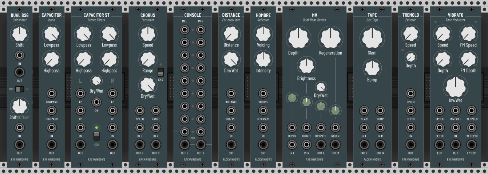
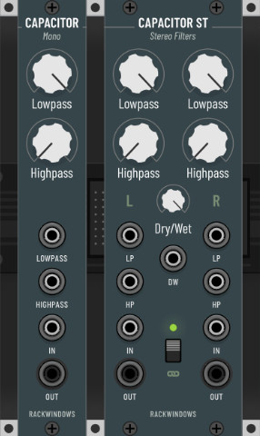
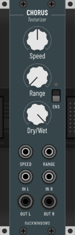
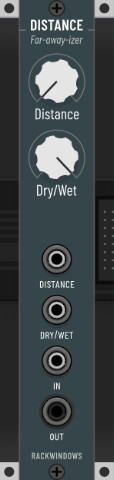
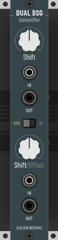
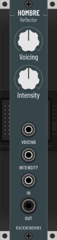
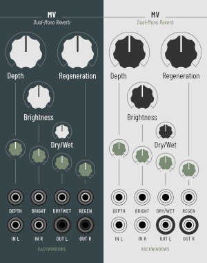
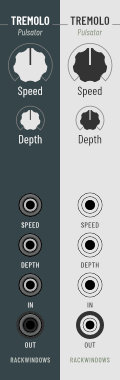
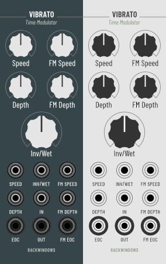

# A collection of VCV Rack modules based on audio plugins by Chris Johnson from Airwindows

Most of these modules are straight-up ports of [Airwindows](http://www.airwindows.com) plugins with the addition of a panel (designed to be potentially buildable in hardware) and the occasional tweak or enhancement to take advantage of the modular environment.

Airwindows plugins are known for exceptional sound quality, innovative approaches and minimalist interfaces. They often focus on and excel at one specific task, which is why I think they are a natural fit for Rack.

For more in-depth information about the inner workings of a particular Airwindows plugin please check Chris' [website](http://www.airwindows.com). There is a video on every plugin along with a description and I encourage everyone to explore his body of work. Chances are you stumble upon other gems here and there. He's got a [Patreon](https://www.patreon.com/airwindows) in case you appreciate and want to support what he does.

## Licence

See [LICENSE.md](LICENSE.md) for all licenses

## Modules

- [Capacitor Mono/Stereo](#capacitor): Filters
- [Chorus](#chorus): Dual-mono chorus with multi-tap option
- [Distance](#distance): Designed to mimic through-air high frequency attenuation
- [Dual BSG](#dual-bsg): Dual gain shifter
- [Hombre](#hombre): Texas tone and texture
- [MV](#mv): Dual-mono reverb
- [Tremolo](#tremolo): Organic pulsating thing
- [Vibrato](#vibrato): FM Vibrator o_O

## Capacitor 

Filters

Comes in both mono and stereo, with the stereo version featuring an additional dry/wet control.

[More information...](http://www.airwindows.com/capacitor)

## Chorus 

Chorus with multi-tap option (Ensemble) 

This surprisingly versatile module is a combination of Airwindows Chorus and ChorusEnsemble. The switch lets you toggle between the two flavours.
[More information...](http://www.airwindows.com/chorus-vst)

## Distance 

Designed to mimic through-air high frequency attenuation

Pushes things back. Also quite nice on reverb returns.

[More information...](http://www.airwindows.com/distance-vst)

## Dual BSG 

Dual gain shifter

Scales a signal up or down by increments of exactly 6 dB. If no input is connected, the respective output will provide constant voltage selectable in 1V steps from -8V to +8V. The lower section can be linked to the upper one to automatically compensate for values set by the upper 'Shift' knob, in which case the lower 'Shift' knob can be used to offset the signal in 6db steps (input connected) or 1V steps (input not connected). 

[More information...](http://www.airwindows.com/bitshiftgain)

## Hombre 

Texas tone and texture

[More information...](http://www.airwindows.com/hombre-vst)

## MV 

Dual-mono reverb

A reverb based on Bitshiftgain and old Alesis Midiverbs. Capable of turning everything into a pad or sustaining a 'bloom' forever. Watch your volume though when using small amounts of depth with full on regeneration.

[More information...](http://www.airwindows.com/mv)

## Tremolo 

Organic pulsating thing

Instead of volume animation Tremolo uses fluctuating saturation and antisaturation curves to create a more organic, somewhat tubey tremolo effect.

[More information...](http://www.airwindows.com/tremolo-vst)

## Vibrato 

FM Vibrator o_O

Make sure to also play with the 'Inverse/Wet' knob for chorusing and flange effects. Two trigger outputs have been added for fun.

[More information...](http://www.airwindows.com/vibrato-vst)

## Colophon

The typeface used is [Barlow](https://github.com/jpt/barlow) by Jeremy Tribby